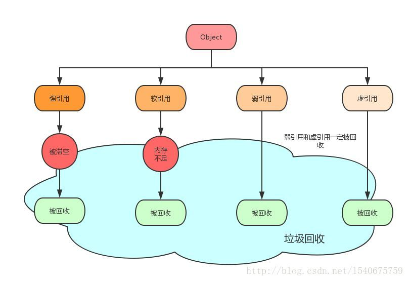

# 基础语法

## 数据类型

### 基础类型

### 包装类型

基本类型都有对应的包装类型，基本类型与其对应的包装类型之间的赋值使用自动装箱与拆箱完成。

| Primitive type （原始类型） | Wrapper class （包装类） |
| :-: | :-: |
| boolean | Boolean |
| byte | Byte |
| char | Character |
| float | Float |
| int | Integer |
| long | Long |
| short | Short |
| double | Double |

#### 自动装箱与拆箱（Autoboxing and Unboxing）

[Example.java](./boxing_unboxing/Example.java)
```java
public class Example {
    public static void main(String[] args) {
        // 装箱
        // int -> Integer
        Integer I = 1;
        // 拆箱
        // Integer -> int
        int i = I;

}
```

### 常量池技术/缓存池

[WrappingTypeCacheExmaple.java](WrappingTypeCacheExmaple.java)

## 关键字

### final

用来修饰类、方法和变量。

* 修饰的变量为常量，是不可修改的
* 父类中的 final 方法可以被子类继承，但是不能被子类重写
* final 类不能被继承，没有类能够继承 final 类的任何特性

### static

静态变量：

static 关键字用来声明独立于对象的静态变量，无论一个类实例化多少对象，它的静态变量只有一份拷贝。 静态变量也被称为类变量。局部变量不能被声明为 static 变量。

静态方法：

static 关键字用来声明独立于对象的静态方法。静态方法不能使用类的非静态变量。静态方法从参数列表得到数据，然后计算这些数据。

### synchronized

TODO:

### transient

序列化的对象包含被 transient 修饰的实例变量时，java 虚拟机(JVM)跳过该特定的变量。

[transientExample.java](./keyword/transientExample.java)

### volatile

volatile 修饰的成员变量在每次被线程访问时，都强制从共享内存中重新读取该成员变量的值。而且，当成员变量发生变化时，会强制线程将变化值回写到共享内存。这样在任何时刻，两个不同的线程总是看到某个成员变量的同一个值。

[Example.java](./keyword/volatile_example/Example.java)

[ReadWriteEfficiencyExample.java](./keyword/volatile_example/ReadWriteEfficiencyExample.java)

### throw VS throws

* throw是具体向外抛异常的，抛出的是一个异常实例
* throws是方法可能抛出异常的声明

```java
public void function() throws NullPointerException {
    if (...) {
        throw new NullPointerException();
    }

    ...
}
```

### super

TODO:

### default

[DefaultMethodExample.java](./default_method/DefaultMethodExample.java)

### 是关键字，但不能使用： goto、const

## 反射

TODO:  java.lang.reflect 

优点：

缺点：


## 异常

### 受检查异常 & 不受检查异常

受检异常 ：需要用 try...catch... 语句捕获并进行处理，并且可以从异常中恢复；
非受检异常 ：是程序运行时错误，例如除 0 会引发 Arithmetic Exception，此时程序崩溃并且无法恢复。

## 泛型

[README.md](./generic/README.md)

### 类型檫除

[TypeErasureExample.java](./generic/TypeErasureExample.java)

## 注解

[README.md](./annotation/README.md)

============================================================

**未归类**

## 获取 Class 类对象三种方式：

## 动态代理

## 序列化与反序列化

## ==和 equals 的区别

## java是值传递还是引用传递

## 重载和重写的区别

## 深拷贝 vs 浅拷贝

引用拷贝和对象拷贝（浅拷贝和深拷贝）

[README.md](./copy/README.md)

[DeepCopyExample.java](./copy/DeepCopyExample.java)
[ShallowCopyExample.java](./copy/ShallowCopyExample.java)

## 内存溢出和内存泄漏


## 对象的4种 引用类型

```java
House seller = new House();
...
seller = null;
```

* 强引用

```java
House buyer1 = seller;
```

* 软引用

```java
SoftReference<House> buyer2 = new SoftReference<House>(seller);
```

* 弱引用

```java
WeakReference<House> buyer3 = new WeakReference<House>(seller);
```

* 虚引用

```java
PhantomReference<House> buyer4 = new PhantomReference<House>(seller, null);
```




Java 4种引用的级别由高到低依次为： 强引用 > 软引用 > 弱引用 > 虚引用

| 引用类型 | 被垃圾回收时间 | 用途 | 生存时间 |
| :-: | :-: | :-: | :-: |
| 强引用 | 从来不会 | 对象的一般状态 | JVM停止运行终止 |
| 软引用 | 在内存不足时 | 对象缓存 | 内存不足时终止 |
| 弱引用 | 在垃圾回收时 | 对象缓存 | gc运行后终止 |
| 虚引用 | Unknown | Unknown | Unknown |

## java创建多线程的4种方法（Thread, Runnable, Callable, ThreadPool）

## 线程间的通信方式（wait(), notify(), notifyAll()）

## java1.8 的monitor底层原理

## system.gc()方法只是通知垃圾回收器清理垃圾（并不是立即清理）
