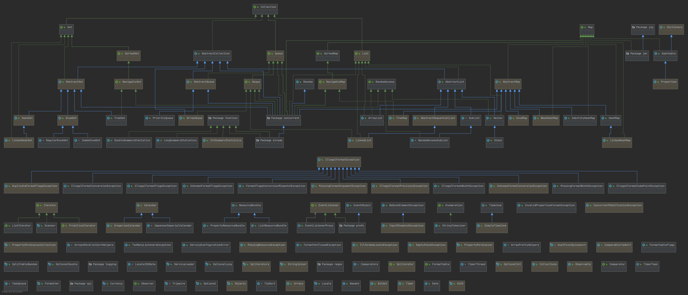

# 集合

* **接口类&具体类**
    * Collection:  一二级为接口，三级为具体实现
        * List
            * LinkedList
            * ArrayList
            * Vector
        * Set
            * HashSet
            * LinkedHashSet
            * TreeSet
        * SortedSet
            * TreeSet
        * Map
            * HashMap
            * HashTable
            * TreeMap
            * LinkedHashMap
            * WeakHashMap
        * Map.Entry
        * SortedMap
            * TreeMap
        * Enumeration
        * Queue
            * PriorityQueue
            * LinkedList
        * Deque
            * ArrayDeque

* **算法Collections**
    * ...
* **其他**
    * Vector
    * Stack
    * Dictionary
    * Hashtable
    * Properties
    * BitSet

===

https://raw.githubusercontent.com/Snailclimb/JavaGuide/master/docs/java/collection/images/Java-Collections.jpeg

