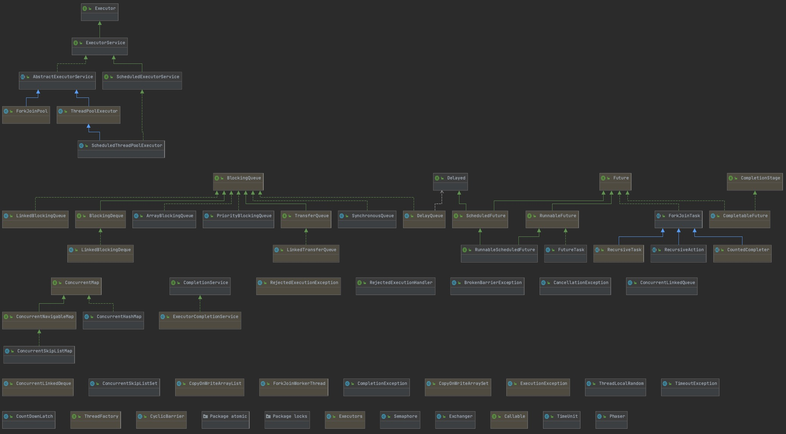
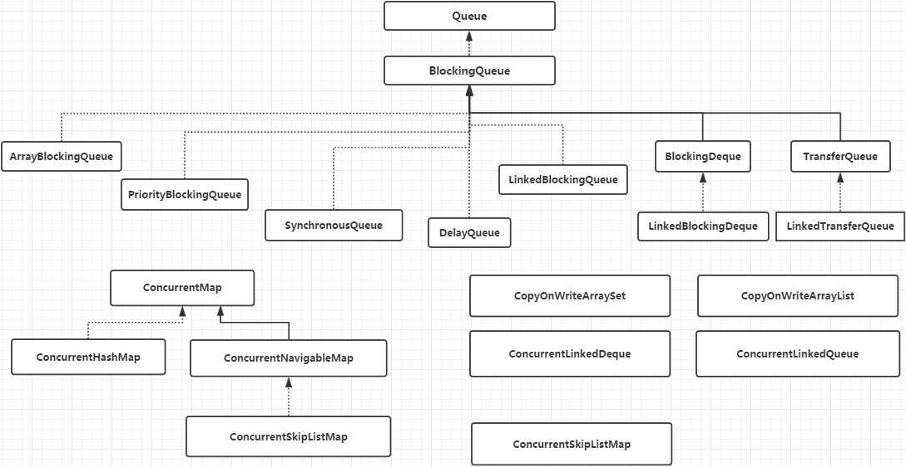

# JUC (java.util.concurrent)

**线程安全集合**

* ConcurrentHashMap: 可以看作是线程安全的 HashMap
* CopyOnWriteArrayList:可以看作是线程安全的 ArrayList，在读多写少的场合性能非常好，远远好于 Vector.
* ConcurrentLinkedQueue:高效的并发队列，使用链表实现。可以看做一个线程安全的 LinkedList，这是一个非阻塞队列。
* BlockingQueue: 这是一个接口，JDK 内部通过链表、数组等方式实现了这个接口。表示阻塞队列，非常适合用于作为数据共享的通道。
* ConcurrentSkipListMap :跳表的实现。这是一个Map，使用跳表的数据结构进行快速查找。

## ConcurrentHashMap

TODO

https://snailclimb.gitee.io/javaguide/#/docs/java/collection/Java%E9%9B%86%E5%90%88%E6%A1%86%E6%9E%B6%E5%B8%B8%E8%A7%81%E9%9D%A2%E8%AF%95%E9%A2%98?id=_149-concurrenthashmap-%e5%92%8c-hashtable-%e7%9a%84%e5%8c%ba%e5%88%ab

https://doc.codingdict.com/java_api/java/util/concurrent/ConcurrentHashMap.html

1.7 vs 1.8

## Queue

TODO: 7中队列对比，表格

### DelayQueue

https://zhuanlan.zhihu.com/p/67948565

业务中并没有用到，MQ可以这样

爬虫 ip/http代理池
    每个ip/http需要需要间歇工作
        https://github.com/javagaorui5944/ProxyIpPool/blob/f42c63c4f780ab289e66e7d94be527567acdcdb9/src/main/java/com/myapp/proxy/ProxyPool.java

延迟队列的6种方式
https://segmentfault.com/a/1190000022718540

### LinkedBlockingQueue

单链表实现的

https://doc.codingdict.com/java_api/java/util/concurrent/BlockingQueue.html

https://www.cnblogs.com/teach/p/10665947.html
https://www.jianshu.com/p/9394b257fdde
