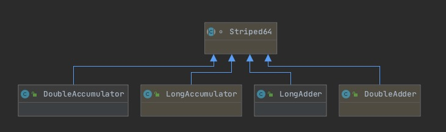

* 基本类型： 标量类
    * Striped64
    * LongAdder
    * DoubleAdder
    * LongAccumulator
    * DoubleAccumulator
* 基本数据类型原子操作：
    * AtomicBoolean
    * AtomicInteger
    * AtomicLong
* 数组类：
    * AtomicLongArray
    * AtomicIntegerArray
* 更新器类
    * AtomicLongFieldUpdater
    * AtomicIntegerFieldUpdater
    * AtomicReferenceFieldUpdater
* 复合变量类：
    * AtomicMarkableReference
    * AtomicStampedReference
    * AtomicReference
    * AtomicReferenceArray
